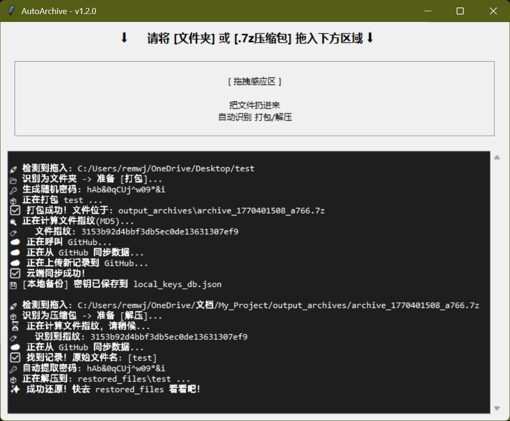

# AutoArchive

  

> **AutoArchive** 是一款轻量级桌面自动化工具，旨在为重要数据提供“无感加密”与“冷备份归档”方案。
> 它解决了网盘限速、资源审查及本地密码管理的痛点。

---

## 🖼️ 预览



## ✨ 核心特性

* **🖱️ 拖拽交互**：极简操作，拖入文件夹即打包，拖入压缩包即解压。
* **🔒 自动加密**：调用 7-Zip 内核进行 AES-256 强加密，自动生成高强度随机密码。
* **☁️ 云端密钥**：基于 **GitHub Gist** 的 Serverless 架构，自动同步文件指纹与密码，无需自建服务器。
* **⚡ 极速传输**：自动将大量碎文件打包成单一大文件（Store 模式），跑满网盘上传带宽。
* **🛡️ 隐私安全**：支持配置分离，敏感信息（Token）与代码完全分离。

## 🚀 快速开始

### 方式一：直接下载 (Windows)
1.  前往 [**Releases**](https://github.com/oukai0529/AutoArchive/releases/latest) 页面下载最新的 `gui.exe`。
2.  确保电脑已安装 [7-Zip](https://www.7-zip.org/)。
3.  双击运行，根据弹窗提示输入 GitHub Token 即可。

### 方式二：从源码运行
```bash
git clone [https://github.com/oukai0529/AutoArchive.git](https://github.com/oukai0529/AutoArchive.git)
cd AutoArchive
pip install -r requirements.txt
python gui.py
```

## ⚙️ 配置说明 (首次运行)

首次运行时，软件会自动弹窗要求输入以下信息以连接云端数据库：

* **GitHub Token**: 用于读写 Gist。请在 GitHub Settings -> Developer settings 中生成，**必须勾选 `gist` 权限**。
* **Gist ID**: 你的云端数据库 ID。请先在 [gist.github.com](https://gist.github.com/) 创建一个空的 Gist，复制 URL 末尾的字符串填入。

## 📄 开源协议

本项目基于 [MIT License](LICENSE) 开源。